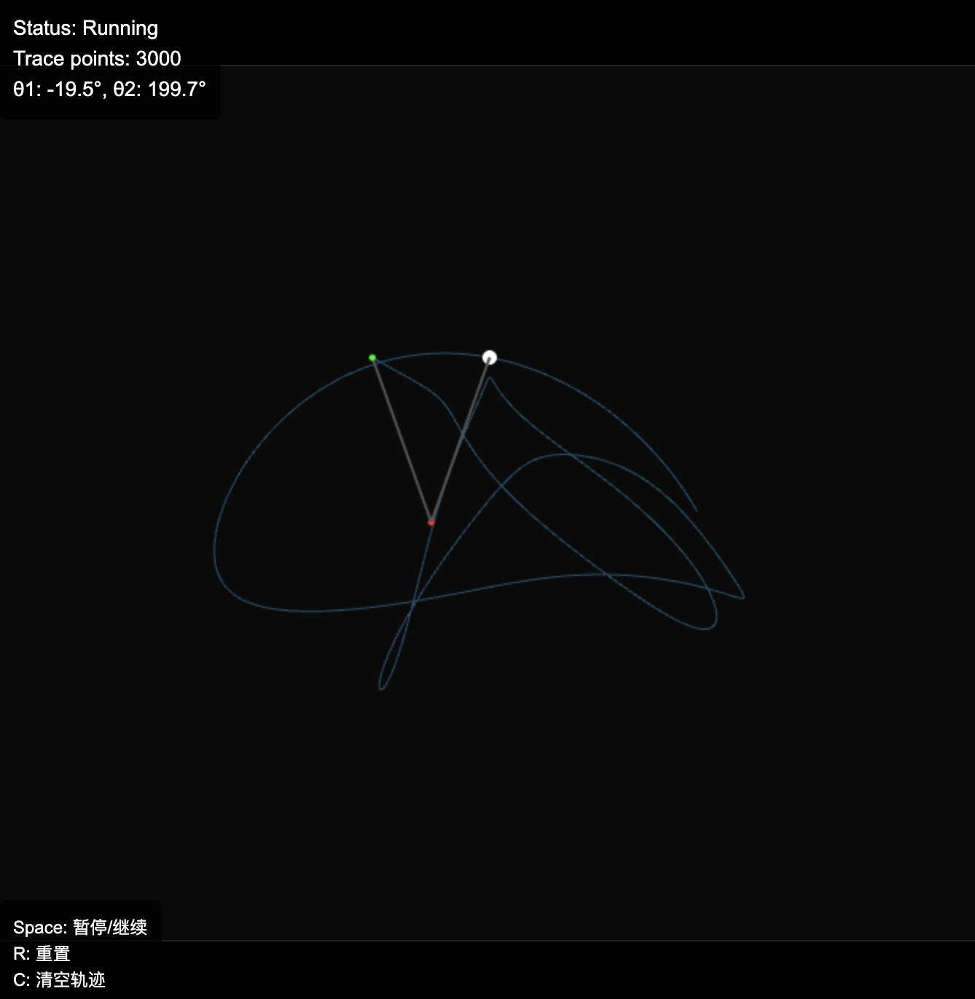

# Double Pendulum - 双摆混沌运动模拟

一个基于 HTML5 Canvas 的双摆混沌运动模拟器，实现了完整的物理模型和轨迹追踪功能。

## 功能特性

### 核心物理模拟
- 基于经典双摆动力学模型
- 使用四阶 Runge-Kutta (RK4) 数值积分方法
- 包含轻微阻尼以提高数值稳定性
- 处理窗口切换导致的超大时间步问题

### 可视化效果
- 实时绘制双摆系统（支点、摆杆、摆锤）
- 末端摆锤轨迹追踪（最多保留 3000 个点）
- 半透明轨迹线，颜色与摆锤区分
- 响应式 canvas 渲染


### 交互控制
- `Space`：暂停/继续模拟
- `R`：重置到初始状态（清空轨迹）
- `C`：仅清空轨迹（保持当前状态）

### 信息显示
- 模拟状态：Running / Paused
- 轨迹点数：实时显示当前轨迹长度
- 当前角度：θ1 和 θ2 的度数显示

## 技术实现

### 物理模型
状态变量：
- θ1, θ2：摆杆与竖直方向的夹角（弧度）
- ω1, ω2：角速度（弧度/秒）

参数设置：
- g = 9.81 m/s²（重力加速度）
- L1 = 120px, L2 = 120px（摆杆长度）
- m1 = 1kg, m2 = 1kg（摆锤质量）
- 初始角度：θ1 = 120°, θ2 = -10°
- 初始角速度：ω1 = 0, ω2 = 0

### 数值积分
- 使用 RK4 方法进行状态更新
- 固定时间步长 dt = 1/240 秒
- 每帧最多处理 10 个子步，防止数值爆炸

## 使用方法

1. 启动本地服务器：
   ```bash
   python3 -m http.server 8081
   ```

2. 在浏览器中打开：
   ```
   http://localhost:8081
   ```

3. 使用键盘控制：
   - 空格键：暂停/继续
   - R 键：重置
   - C 键：清空轨迹

## 文件结构

```
DoublePendulum/
├── index.html          # 主页面，包含 canvas 和 UI
├── double-pendulum.js  # 双摆物理模拟核心逻辑
└── README.md           # 说明文档
```

## 运行效果

- 双摆系统会呈现混沌运动特性
- 末端摆锤轨迹会逐渐形成复杂的花纹
- 系统会自动处理数值稳定性问题
- 支持实时交互控制

## 浏览器兼容性

- 需要支持 HTML5 Canvas
- 需要支持 ES6 类和箭头函数
- 建议使用现代浏览器（Chrome, Firefox, Safari, Edge）